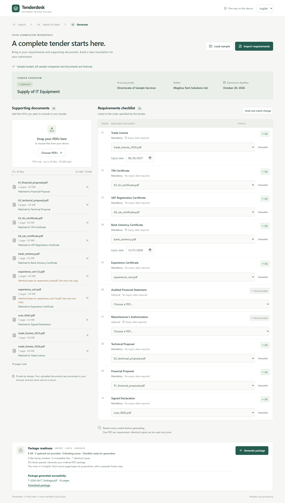
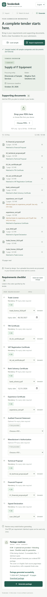

# Tenderdesk

### Tender Document Package Builder

**Turn supporting PDFs into one checked, correctly ordered tender submission.**

Tenderdesk helps office staff import tender requirements, match documents, check expiry dates, identify identical copies, and generate a complete PDF package. All document processing happens in the browser. English and Bangla interfaces preserve the same working state.

## Screenshots

### Desktop

The completed sample shows document assignments, expiry checks, duplicate notices, readiness counts, and the generated package download.



<details>
<summary><strong>Mobile — English and Bangla</strong></summary>

| English | Bangla |
| --- | --- |
|  |  |

</details>

## Features

- Validated JSON imports with tender details and requirements sorted by order.
- Multiple PDF uploads with actual filenames and page counts.
- One PDF per requirement, with replacement, unmatching, and undo.
- Expiry validation for mandatory and matched optional documents.
- Browser-side SHA-256 duplicate detection; identical copies cannot serve different requirements.
- Immediate checklist statuses, blocker reasons, and readiness counts.
- Ordered PDF generation with an English cover and page footers.
- Responsive desktop/mobile layouts and English/Bangla controls.
- Local document processing without a backend, database, or online document storage.

## Quick start

Use Node.js 24 and npm. From the directory containing `package.json`:

```sh
npm ci
npm run dev
```

Open the local address printed by Vite, normally `http://127.0.0.1:5173`.

### Production build

```sh
npm run typecheck
npm run build
npm run preview
```

Deploy the generated `dist/` directory to a static HTTPS host. No backend or environment variables are required. Use localhost or HTTPS for Web Crypto support.

## How to use

1. Choose **Import requirements** and select `requirements.json`, or choose **Load sample**.
2. Upload supporting PDFs and wait for page reading and duplicate checks.
3. Choose a PDF for each requirement. Already assigned files and identical copies cannot be used elsewhere.
4. Enter expiry dates where required. An expiry equal to the submission deadline is valid.
5. Resolve blocking statuses, then choose **Generate package**.
6. Save the PDF. A **Download package** link remains available after generation.

Replacing a match clears its expiry date. Undo restores the previous match and date without changing other rows. Removing a file clears its assignment and undo history. A new valid JSON import resets assignments/dates while retaining uploads; invalid imports preserve the current tender. Load sample replaces the tender and uploaded files. Changing package inputs invalidates previous output and prevents stale generation results.

## Status rules

Each requirement has exactly one status.

| Status | Condition | Blocks generation |
| --- | --- | --- |
| Missing | Mandatory requirement has no matched PDF | Yes |
| Not provided | Optional requirement has no matched PDF | No |
| Expiry date needed | Matched PDF requires a valid expiry date that has not been entered | Yes |
| Expired | Expiry date is before the deadline | Yes |
| OK | Matched PDF passes all applicable checks | No |

Matched optional documents follow the same expiry rules. Unused duplicates do not block generation, but assigning identical bytes to different requirements is prevented. Pending file checks block generation; unreadable unassigned PDFs are excluded.

## Input format

Different tenders use the same structure; application logic does not depend on sample IDs, filenames, or counts.

```json
{
  "tender": {
    "tender_id": "DEMO-001",
    "title": "Office Equipment Procurement",
    "procuring_entity": "Example Procurement Office",
    "bidder": "Example Supplier Ltd.",
    "submission_deadline": "2026-12-15"
  },
  "requirements": [
    {
      "id": "DOC-01",
      "order": 1,
      "title_en": "Trade License",
      "title_bn": "ট্রেড লাইসেন্স",
      "mandatory": true,
      "has_expiry": true
    }
  ]
}
```

Required tender fields must be non-empty text, and the deadline must be a real `YYYY-MM-DD` date. Requirements must be a non-empty list with unique IDs, unique positive integer orders, non-empty English/Bangla titles, and boolean mandatory/expiry fields.

## Generated PDF

The first page is an English cover containing tender details, the creation date in Bangladesh time, and included documents in order. All pages of matched PDFs follow in their original internal order. Unmatched optional requirements and unassigned uploads are excluded.

Every page has `<tender_id> | Page X of Y`. Source pages receive a separate footer area to avoid covering content. Mixed page sizes, crop boxes, rotation, and UserUnit are handled. Normal pages retain vector content; annotated/widget pages are rendered locally to preserve their visible appearance.

Output filename: `<tender_id>_Package.pdf`, with unsafe filename characters replaced.

[View the generated sample package](output/T-2026-0417_Package.pdf) — 16 pages including the cover, with eight included documents and two optional requirements omitted. All sample companies and documents are fictional.

## Stack

| Technology | Purpose |
| --- | --- |
| React + TypeScript | Interface and application state |
| Vite | Development server and static build |
| PDF.js | Page counts and annotated-page rendering |
| PDF-lib + fontkit | PDF assembly, cover, and footers |
| Web Crypto API | SHA-256 duplicate detection |
| Lucide React | Icons |
| Noto Sans Bengali | Bangla typography |
| Playwright | Browser tests |

## Project structure

```text
src/
  main.tsx              Application state and workflow
  RequirementList.tsx   Matching, expiry controls, and statuses
  model.ts              Input validation and upload limits
  review.ts             Status, duplicate, and readiness rules
  pdf.ts                PDF reading and rendering
  generate.ts           Cover, document assembly, and footers
  strings.ts / bn.ts    English and Bangla copy
  *.css                 Responsive styles
public/
  sample-pack/          Fictional test documents and requirements
  fonts/                PDF font and its license
screenshots/            Desktop and mobile screenshots
tests/                  Import, review, and generation tests
output/                 Generated sample PDF
```

## Verification

```sh
npx playwright install chromium
npm test
npm run typecheck
npm run build
```

Tests cover sample/alternate imports, invalid JSON/structure, actual PDF page counts, non-PDF rejection, unreadable/password-protected files, upload limits, duplicate bytes, same-name files with different bytes, matching/undo/removal, optional expiry, deadline equality, language-state retention, generation failure/retry, stale results, PDF contents/page counts, mixed sizes/rotations/annotations, and mobile overflow.

Set `TEST_PORT` to a free port if needed. `TEST_BROWSER_PATH` can select an existing Chromium executable; `TEST_DOWNLOADS_PATH` can set a download directory.

In the Windows AppContainer test environment, native Blob downloads may be cancelled. Tests verify the download event and filename, then inspect the exact generated browser Blob for that specific cancellation. The app also provides an explicit download link.

## Privacy and limitations

- Maximum 30 PDFs and 50 MiB total, displayed as 50 MB.
- Uploaded document bytes stay in the browser. Requests serve static assets/fonts and the explicitly requested sample pack.
- Work is held in memory and is lost on reload.
- Large PDFs can consume significant memory. Annotated pages render at up to 144 dpi with a 16-megapixel canvas cap.
- Interactive form behavior, clickable annotations, and cryptographic signatures are not preserved; visible appearances are included.
- Unsupported cover characters or excessive cover content produce a clear error instead of clipped output.
- Matching and expiry entry are manual. OCR, automatic matching, persistent projects, and bonus exports are outside the current scope.

## License

The original application code is licensed under the [MIT License](LICENSE). Third-party libraries and bundled fonts retain their respective licenses. The fictional sample pack remains subject to its supplied usage terms and is not relicensed by the application's MIT license. See `public/fonts/OFL.txt` for the bundled PDF font license.
